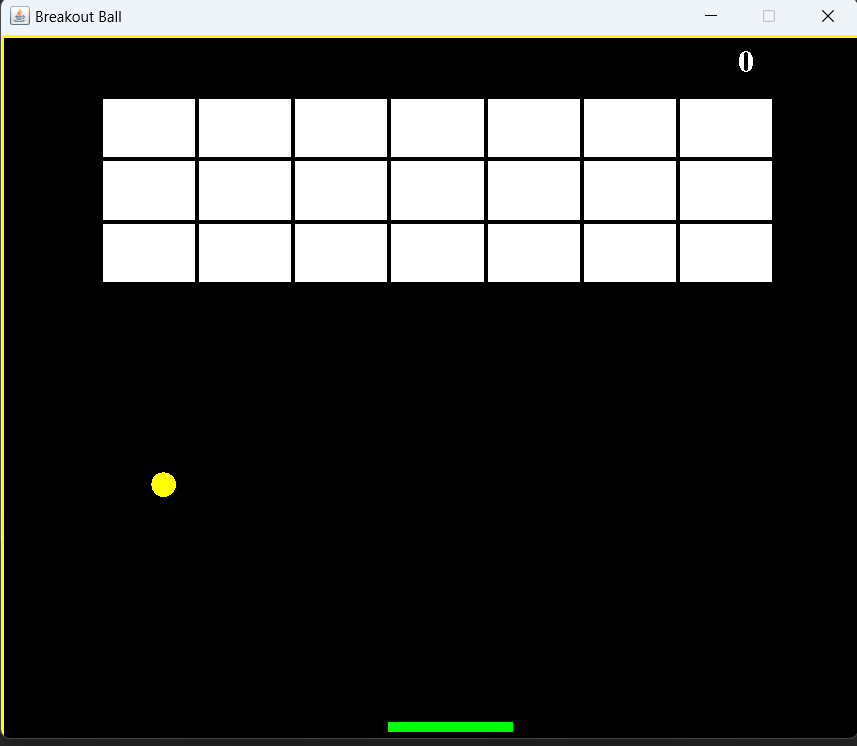
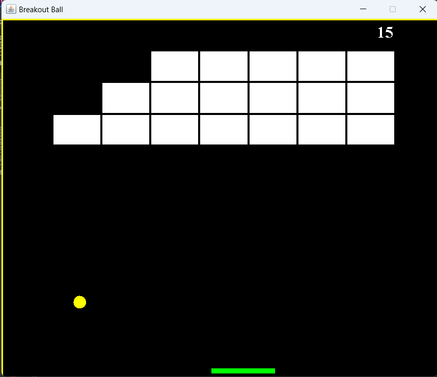
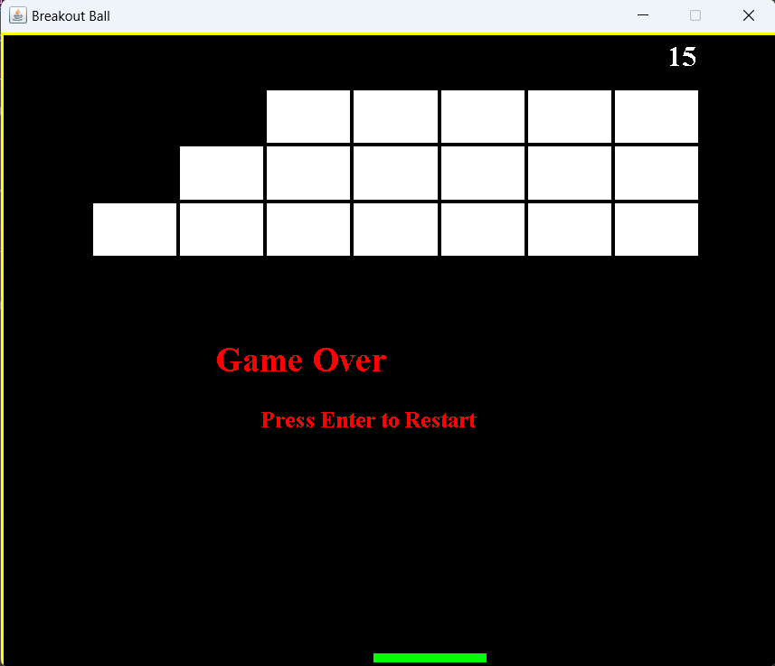

# 🎮 Brick Breaker Game (Java Swing)

A simple and classic **Brick Breaker game** built using **Java**, **Swing**, and clean **Object-Oriented Programming (OOP)** concepts.  
The game includes smooth paddle movement, collision detection, scoring, and restart functionality.

---

## 🚀 Features

- 🧱 Multi-row brick layout  
- 🟡 Realistic ball movement  
- 🏏 Smooth paddle control  
- 🎯 Score tracking  
- 🔁 Game Over + Restart  
- 💡 Beginner-friendly project  
- 🧩 Clean and easy-to-understand Java code  

---

## 📸 Screenshots

### 🟦 Game Start


### 🟧 Bricks Breaking (Mid Game)


### 🔴 Game Over Screen


---

## 🛠️ Technologies Used

- **Java (Core + OOP)**
- **Java Swing**
- **Java AWT**
- **2D Graphics**
- **KeyListener Events**
- **Timers for game loop**

---

## 📂 Project Structure

```
Main.java
Gameplay.java
MapGenerator.java
```

- **Main.java** → Creates Game Window (JFrame)  
- **Gameplay.java** → Game logic, movement, collision, score  
- **MapGenerator.java** → Brick layout generator  

---

## ▶️ How to Run the Game

### **1️⃣ Clone the Repository**
```
git clone https://github.com/rohit5434/BrickBreaker-Game.git
```

### **2️⃣ Open Folder**
```
cd BrickBreaker-Game
```

### **3️⃣ Compile the Java Files**
```
javac *.java
```

### **4️⃣ Run the Game**
```
java Main
```

🎉 The game will launch instantly!

---

## 🧠 What I Learned

- Using **Java Swing** for GUI applications  
- Designing a **2D game loop** using Timer  
- Handling **keyboard events**  
- Detecting collisions in 2D space  
- Using **OOP** to structure game components  
- Making a polished mini-project for portfolio

---

## 🔮 Future Enhancements

- Multiple levels  
- Sound effects  
- Power-ups (bigger paddle, double ball, laser)  
- Animations  
- Enhanced UI  
- Saving high scores  

---

## 🤝 Contributing
Pull requests are welcome!  
You can fork the repository and add new features or improvements.

---

## 📜 License
This project is open-source and free for anyone to use.

---

## ✨ Developer

**Rohit Mishra – B.Tech CSE (2026)**  
Beginner Java Developer | Game Development Enthusiast  
GitHub: https://github.com/rohit5434

